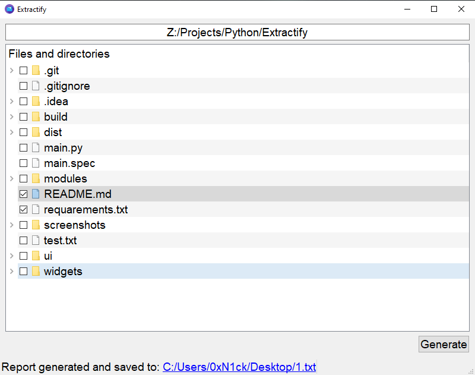

# Extractify

Extractify is a simple PyQt5-based application designed for handling a moderate number of files and directories. It provides a convenient way to select and extract specific files, consolidating them into a single report file.



## Features

- **User-Friendly Interface:** The application offers a clean and intuitive user interface, making it easy to navigate and use.

- **File Selection:** Choose a main directory using the provided directory picker. The application allows you to select specific files and directories within the chosen main directory.

- **Report Generation:** Generate a report containing the content of the selected files. The report is saved as a text file, providing a consolidated view of the chosen files.

- **Limited Scope:** Please note that Extractify is not optimized for handling a large number of files. It is recommended for scenarios where the number of files to be processed is moderate.

## Usage

1. **Choose Main Directory:**
   - Click on the "Choose main directory..." placeholder and select the desired main directory using the folder picker.

2. **Select Files:**
   - Navigate through the directory tree displayed in the application.
   - Check the desired files and directories that you want to include in the report.

3. **Generate Report:**
   - Click the "Generate" button to create a report containing the content of the selected files.

4. **Save Report:**
   - Choose a location to save the report file.

5. **View Report:**
   - The status bar at the bottom of the application provides a clickable link to open the generated report in your default text file viewer.

## Limitations

- **Not Suitable for Large Datasets:** Extractify is designed for scenarios where the number of files is not excessively large. It may not provide optimal performance for handling a massive number of files.

- **Text Files Only:** The application generates reports in text file format (.txt).

## Getting Started

1. Clone the repository to your local machine.

2. Install the required dependencies listed in `requirements.txt` using the following command:
   ```bash
   pip install -r requirements.txt
   ```

3. Run the application:
   ```bash
   python main.py
   ```
   
## Troubleshooting

While working with PyQt5 applications on Linux systems, you might encounter an error related to the Qt platform plugin “xcb”. This issue typically looks like this:

qt.qpa.plugin: Could not load the Qt platform plugin “xcb” in “” even though it was found.
This application failed to start because no Qt platform plugin could be initialized. Reinstalling the application may fix this problem.
Available platform plugins are: xcb, eglfs, linuxfb, minimal, minimalegl, offscreen, vnc, wayland-egl, wayland, wayland-xcomposite-egl, wayland-xcomposite-glx, webgl.
Aborted (core dumped)

### Solution

If you encounter the above error, it indicates a problem with the Qt platform plugin “xcb”. To resolve this issue, you can try reinstalling the libxcb-xinerama0 package which is a dependency for the Qt platform plugin to function correctly on Linux systems.

To reinstall libxcb-xinerama0, execute the following command in the terminal:

```
sudo apt-get install --reinstall libxcb-xinerama0
```

This command will reinstall the required library to ensure the PyQt5 application can start successfully without encountering the “xcb” plugin error.

## Acknowledgments

Extractify utilizes PyQt5 for its graphical user interface and offers a simple solution for extracting and consolidating selected files. We appreciate the PyQt5 community for their contributions.

## License

This project is licensed under the [MIT License](LICENSE). Feel free to use, modify, and distribute it according to the terms of the license.